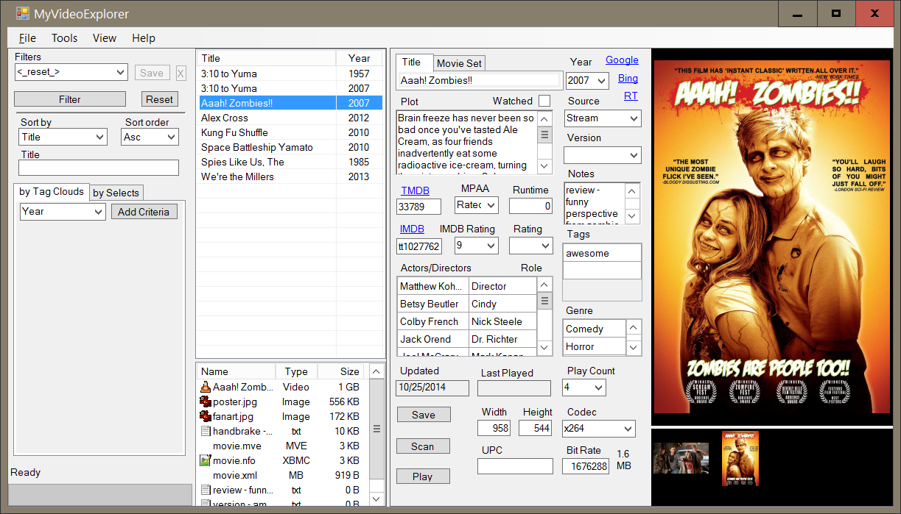

MyVideoExplorer 
======================
C# desktop program to catalog dvd/blurays

screenshot
========

change log
========
2018-11-21 version 0.5.0393396 release 2018-1121-2153
* released to github
* built against visual studio 2017, .net 4.5

2014-10-26 version 0.5.0
* working version
* built against visual studio 2013, .net 3.5

2014-05-11 version 0.0.1
* started
* initial repository Team Foundation Server (TFS)
    * which was renamed to Visual Studio Team System (VSTS)
    * which was renamed to Azure DevOps

license
========
http://opensource.org/licenses/MIT

